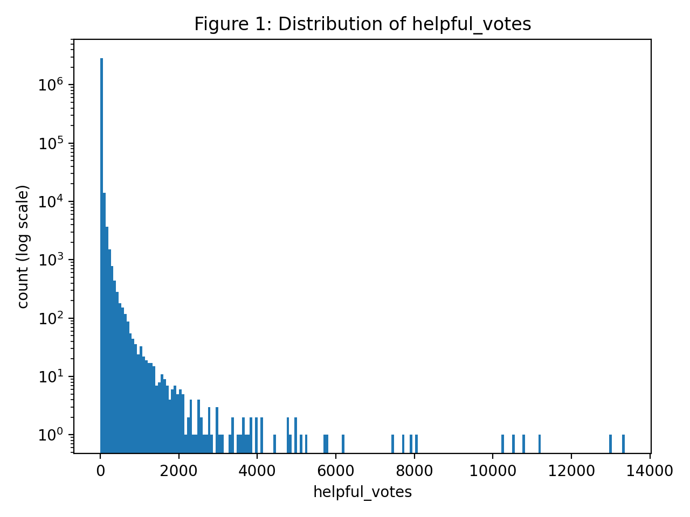
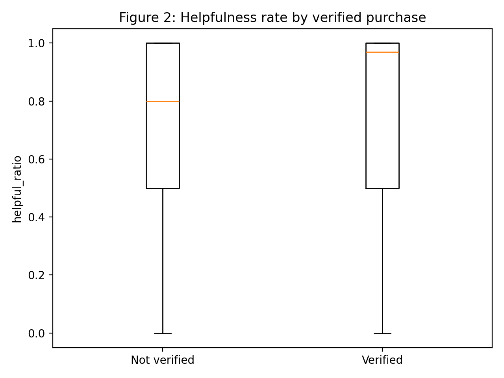
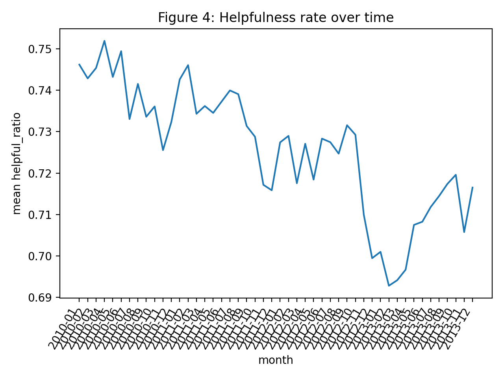

# Do Verified Purchases and Review Detail Predict Helpfulness on Amazon?

**Author:** Natalie Sakamoto

## 1. Hypothesis

**Hypothesis:** Reviews that are verified purchases and have more
detailed text receive more helpful votes, on average, after controlling
for star rating, product category, and time.\
**Why:** People are more likely to trust a review if it looks like the
reviewer actually bought and used the product. A detailed review gives
potential buyers more information so they are more likely to mark
“helpful”.

### Variables of interest

**Outcome variable (target):**\
-`helpful_votes`: Number of times review was marked as “helpful” (int)

**Predictors:**\
– `verified_purchase`: Whether the reviewer purchased the item (binary)

\- review detail measured as `review_body_word_count` (int), modeled as
`log_review_words = ln(1 + review_body_word_count)`

**Controls:**\
- `star_rating` : Rating the reviewer gave the product from 0 - 5
(categorical)

\- `product_category` : Category of the product (categorical)

\- `review_date` : Month and Year of the review (modeled as month fixed
effects: `ym = YYYY-MM`)

**Note:** I used an offset for `log(total_votes)` so the model can
compare reviews fairly (modeling the expected helpful votes per unit of
total votes (helpfulness rate) while automatically weighting reviews
with more votes more heavily)

------------------------------------------------------------------------

## 2. Data

### 2.1 Source and scope

I used Amazon reviews data from 2012-2013 stored in Parquet format
(originally \~18 GB). The dataset I performed analysis on was filtered
to five categories that I frequently shop in (46 MB parquet):

-   Apparel\
-   Beauty\
-   Jewelry\
-   Video Games\
-   Health & Personal Care

I only kept reviews with `total_votes > 0` for modeling, since the
helpfulness rate is only meaningful if someone voted.

### 2.2 Final modeling columns

-   `helpful_votes` (int)
-   `total_votes` (int)
-   `verified_purchase_int` (0/1)
-   `review_body_word_count` (int)
-   `log_review_words = ln(1 + review_body_word_count)`
-   `star_rating` (factor)
-   `product_category` (factor)
-   `ym` (YYYY-MM)
-   `log_total_votes = ln(total_votes)` (offset)

------------------------------------------------------------------------

## 3. Exploratory Data Analysis (EDA)

### Figure 1 - Helpful votes are heavy-tailed (many small counts, few very large)

 Most
reviews have very few helpful votes as seen by the tall bars near zero.
Negative Binomial is optimal for our data since it will handle the skew
and outliers.

### Figure 2 - Verified vs non-verified: helpfulness rate distribution

Verified reviews tend to have higher helpfulness rates as seen by the
higher placed orange 50 percentile line for verified reviews.

### Figure 3 - Review detail is skewed and longer reviews tend to be more helpful

 As word count increases, there
is an increase in mean helpfulness ratio (before controlling for
rating/category/time).

### Figure 4 - Time effects: helpfulness changes across months

 It
was important to control for date, as average helpfulness ratio changes
over time.

------------------------------------------------------------------------

## 4. Methodology

### 4.1 Model choice: Negative Binomial GLM with offset

I modeled helpful votes as a count outcome using a Negative Binomial
generalized linear model (GLM) with a log link:

$$
\log(E[\text{helpful_votes}]) =
\beta_0
+ \beta_1(\text{verified})
+ \beta_2(\log(1+\text{review words}))
+ \gamma(\text{star rating})
+ \delta(\text{category})
+ \tau(\text{month})
+ \log(\text{total votes})
$$

The offset $\log(\text{total votes})$ makes interpretation closer to
helpfulness rate per vote exposure.

#### Equation Term Definitions

$E[\text{helpful_votes}]$: the expected average number of helpful votes
the model predicts for a review based on it's features

$\beta_0$ (intercept): the baseline log-expected helpful votes for the
reference group (omitting star rating, category, and month) when
`verified` = 0 and `log(1+review words)` = 0

$\beta_1$: is the effect of being verified on the log expected helpful
votes

$\beta_2$: how much the log expected helpful votes change as review
length increases on this log scale

$\gamma$: a set of coefficients for each star rating level

$\delta$: a set of coefficients for category

$\tau$: a set of coefficients for each month bucket

### 4.2 Inference

I used robust standard errors (HC3) and tested one-sided hypotheses:

-   $H_{1}: \beta_1 = \beta_{\text{verified}} > 0$ (verified reviews get
    more helpful votes)
-   $H_{2}: \beta_2 = \beta_{\text{detail}} > 0$ (longer reviews get
    more helpful votes)

Since the dataset is large, statistical significance is expected for
even for small effects, so I will measure effect sizes using **IRRs**
(incidence rate ratios), where:

$$
IRR = e^{\beta}
$$

------------------------------------------------------------------------

## 5. Results

### 5.1 Regression summary (N = 2,899,615)

**Coefficients of Interest:**

-   `verified_purchase_int`: **β = 0.0222**, IRR = **1.0224**
-   `log_review_words`: **β = 0.0715**, IRR = **1.0742**

Both were highly statistically significant (z = 31 and z = 208 and the
p-values were effectively 0).

### 5.2 Interpretation (effect sizes)

**Effect of verified purchase:**\
IRR = 1.0224: Verified purchase reviews receive about 2.24% more helpful
votes on average than non-verified reviews (holding controls constant).

**Effect of review detail:**\
IRR = 1.0742: Doubling review length (roughly) corresponds to an
increase of \~ln(2) in the log feature, which is about:

$$  \exp(0.0715 \cdot \ln(2)) \approx 1.05$$

This means that there are 5% more helpful votes for doubling word count
(holding controls constant).

Note: Because detail is log-transformed it is easier to interpret as
proportional increases.

### 5.3 Controls 

-   Star rating terms (γ) were higher for larger star ratings, meaning
    that higher-stared reviews tend to receive higher helpfulness.
-   Categories (δ) differed meaningfully (e.g. Video Games had a lower
    baseline helpfulness than the reference category (apparel)).
-   Month (𝜏) fixed effects were significant and were mostly negative
    compared to early baseline months.

------------------------------------------------------------------------

## 6. Conclusion: Was the hypothesis supported?

**Yes, the hypothesis is supported.**\
After controlling for star rating, product category, and time, and
controlling for exposure through an offset of `log(total_votes)`, I
found:

-   Verified purchase reviews have higher expected helpful votes
-   More detailed reviews have higher expected helpful votes

**Takeaway:** Verified purchase status matters, but review detail
matters more. Being a verified purchaser accounts for a small increase,
while increasing review informativeness has a larger association with
helpfulness.
